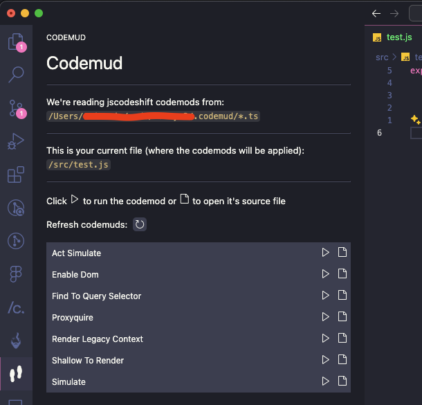

# Codemud README
> Run codemods easy peezy. 👣

Codemud is a VSCode extension that makes it really easy to run `jscodeshift` scripts on any file. The use cases for it vary from testing `jscodeshift` scripts to performing automated code migrations when it's necessary a file-by-file analysis.



# How to use?

1. To use Codemud, you first need the [jscodeshift](https://github.com/facebook/jscodeshift) library installed:
```sh
$ npm install -g jscodeshift
```

2. Codemud will read codemods from the `.codemud` folder in your root directory (`<project-root>/.codemud`). You should put all of your [transform modules](https://github.com/facebook/jscodeshift?tab=readme-ov-file#transform-module) there, each one in a separate file. Codemud will use the name of the files to generate the name of the codemuds. These can also be Typescript modules, in this case, that may be good to install the `jscodeshift` types inside your `.codemud` folder:
```sh
// inside <project-root>/.codemud

$ npm install @types/jscodeshift --save-dev
```

What to contribute? [Check here](https://github.com/carloseustaquio/codemud/blob/main/CONTRIBUTE.md)